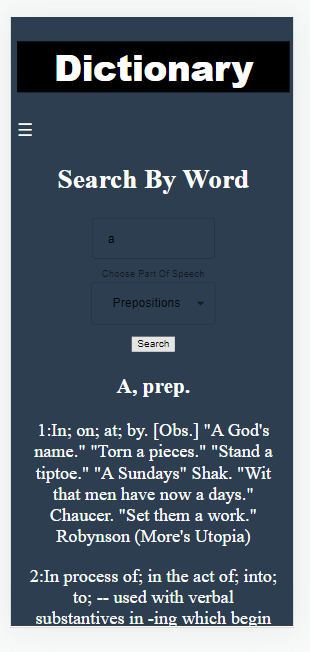

# Welcome To My Dictionary

### Dictionary website: http://dictionary-ofir.s3-website-eu-west-1.amazonaws.com/

## In my dictionary, you can search by three options:

## 1. Search by word:

### When you click on a word from the search result, the dictionary searches for it.

## 2. Search by word and part of speech (pos):

## 3. A random word from part of speech (pos):

